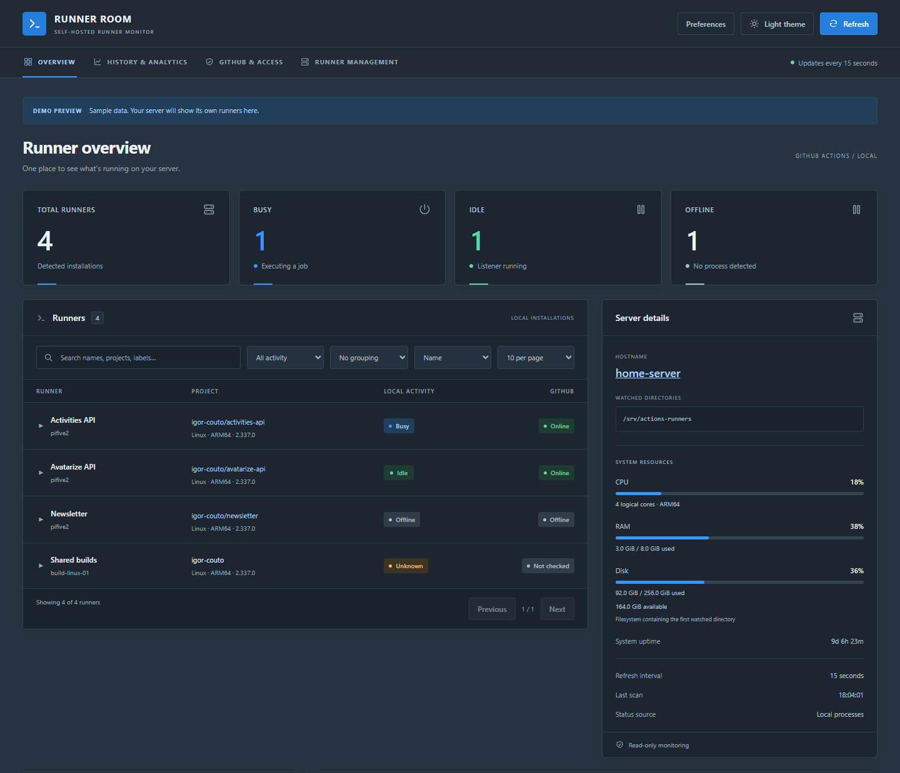
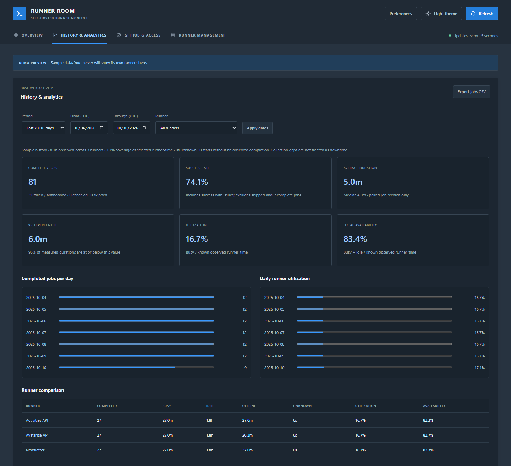

# Runner Room

A dashboard for monitoring and managing GitHub Actions runners on your Linux server, including Raspberry Pi. Install it with one command and open it on your local network. Local monitoring works without a GitHub token.

[Install](#install) · [Support](#support) · [License](#license)



## Features

- **Runner visibility:** Busy, Idle, Offline, and Unknown states; searchable inventory, labels, repository details, current jobs, and diagnostic logs.
- **System monitoring:** CPU, RAM, disks, network traffic, processes, runner resource usage, and supported hardware sensors.
- **History and alerts:** runner activity and job analytics, historical resource readings, scheduled checks, and configurable alerts.
- **Optional GitHub integration and management:** connectivity checks, runner registration and lifecycle actions, groups, updates, and workflow rerun/cancellation. Management requires explicit configuration and administrator access.
- **Customizable dashboard:** movable widgets, saved filters and layouts, dark/light/system/night themes, English and Portuguese, compact and TV modes.
- **Alternative interfaces:** an installable web app, readable/JSON CLI, interactive terminal dashboard, and an optional Windows tray prototype.

Built with C# / ASP.NET Core and plain HTML, CSS, and JavaScript. Self-contained releases support Linux **x64, ARM32, and ARM64**; no separate .NET installation is needed.


### History and analytics



## Install

Run this on the server where your runners live. Change the folder at the end:

```bash
curl -fsSL https://github.com/igor-couto/github-self-hosted-runner-manager/releases/latest/download/install.sh \
  | sudo bash -s -- --runners /srv/actions-runners
```

The folder should contain your runner installations:

```text
/srv/actions-runners/
  runner-one/    # .runner, bin/Runner.Listener, ...
  runner-two/
```

The installer downloads the correct Linux release, checks its SHA-256 checksum, configures the folder, creates a systemd service, enables startup after reboot, and prints the dashboard URL. **Users do not need to install .NET, Git, or Docker.** The .NET runtime is included.

Open `http://YOUR_SERVER_IP:8080` on your local network.

Supported: glibc-based Linux with systemd, on **x64, ARM32 (ARMv7+), or ARM64** (for example Debian 12 or Ubuntu 22.04/24.04 where that architecture is available). Standard utilities including Bash, curl, tar, sha256sum, and util-linux must be present. The installer detects both CPU and userspace bitness, including Raspberry Pis with a 64-bit kernel and 32-bit OS. ARMv6 devices, Alpine/musl, and normal isolated Docker containers are not supported installation targets.

> Maintainers: this command becomes available after the first release containing these installer changes is published. See **Publishing releases** below.

### Optional settings

```bash
curl -fsSL https://github.com/igor-couto/github-self-hosted-runner-manager/releases/latest/download/install.sh \
  | sudo bash -s -- --runners /home/igor/runners --user igor --port 8090
```

| Option | Default | Meaning |
| --- | --- | --- |
| `--runners` | Required | Parent runner folder, or one runner installation |
| `--user` | Runner folder owner | Existing Linux account that runs your runners |
| `--port` | `8080` | Dashboard port, between 1024 and 65535 |
| `--version` | `latest` | Specific release, for example `v0.1.0` |

If the parent folder is owned by root, supply `--user` explicitly. Using the runner account lets the dashboard inspect its processes. Unknown means permissions or process visibility prevent a reliable answer.

To inspect the script before running it instead:

```bash
curl -fsSL https://github.com/igor-couto/github-self-hosted-runner-manager/releases/latest/download/install.sh -o install.sh
less install.sh
sudo bash install.sh --runners /srv/actions-runners
```

## Updating and configuration

Run the **same install command** again to update. It reapplies the folder, user, and port from those arguments, so keep any custom flags. If startup fails, the installer restores the previous binary, configuration, and service.

Settings are stored in `/etc/runner-room/runner-room.env`. You can edit them and restart:

```bash
sudoedit /etc/runner-room/runner-room.env
sudo systemctl restart runner-room
```

Check status or application logs:

```bash
sudo systemctl status runner-room
sudo journalctl -u runner-room -n 50 --no-pager
```

The service runs as the selected account. Application files live under `/opt/runner-room/releases`, with `/opt/runner-room/current` pointing to the active installation. Previous versions are retained for rollback. The installer only manages Runner Room; it does not change your GitHub runner services.

Access is open to your trusted LAN by default. Enable the optional sign-in and permissions described below to restrict access. If your firewall blocks the chosen port, allow it from your home subnet. The installer does not change firewall rules or expose the dashboard through your router.

## What the status means

- **Busy:** a local `Runner.Worker` from that installation is running.
- **Idle:** its `Runner.Listener` is running with no visible worker, and process visibility is reliable.
- **Offline:** no matching process was found and process visibility is reliable.
- **Unknown:** permissions or process visibility prevent determining activity reliably.

**Local activity and GitHub connectivity are independent.** A listener can run while disconnected. The GitHub column reports Online/Offline only after an optional API check; otherwise it shows Not checked or Unknown. A failed API request never becomes Offline. API results are cached for up to 60 seconds, with their check time in the expanded details; local readings refresh every 15 seconds. Local activity is not overwritten by GitHub's potentially older busy flag.

Select a runner to expand its registered name, repository or organization scope, labels, machine, installed platform/version, process/PID/uptime, service name/state, last observed job and job activity time. Group by repository, organization/owner, machine, custom group, or registered runner group. Search includes display names, registered names, directories, projects, custom groups, machines, and GitHub labels.

Repository metadata and runner group come from `.runner`; the group is the locally recorded registration group, not a fresh GitHub group lookup. Platform comes from the runner's ELF executable; version comes from its assembly metadata or resolved `bin.VERSION`, never the installation folder's potentially outdated name. Uptime is the listener process age (or worker age if no listener is visible). Service state comes from a read-only `systemctl show`; unavailable systemd access shows Unknown, and runners without `.service` show Not configured. Missing metadata is explicitly unavailable.

For last-job information, the app reads only recognized job start/completion summary lines from the tails of up to five recent `_diag/Runner_*.log` files (256 KiB per file). Last activity means the most recent **recorded job event**, not a heartbeat or filesystem modification time. Old/rotated logs may leave this unavailable; an observed start without a completion does not prove the job is still running. Runner credential files and job workspaces are never exposed. Starting or stopping runners requires the separately enabled management feature below.

## Current jobs and logs

Expand a runner to see its **Current job**: job name, workflow, repository, branch/ref, commit, triggering user/event, worker start time and elapsed time. Observed steps show running, succeeded, failed, skipped, canceled or unknown states and durations. A workflow link opens the complete run and job output on GitHub when a valid run ID is available. These features work locally **without a GitHub token**.

Current job details require a visible `Runner.Worker` process with a readable start time and a matching `_diag/Worker_YYYYMMDD-HHMMSS-utc.log`. A five-second startup tolerance matches the log to the process; an old job is never inferred merely from the newest file. The reader extracts only selected metadata from the first 1 MiB and recognized step events from the latest 256 KiB when the file grows larger. Earlier steps may be unavailable; the UI labels partial readings and does not invent a completion percentage or success result. Elapsed time is worker process age, which includes job setup. These diagnostic formats are internal to the [GitHub runner](https://github.com/actions/runner/blob/main/src/Runner.Worker/Worker.cs) and may change; missing metadata is shown as unavailable.

**View logs** opens a local diagnostic viewer for each runner, including idle/offline runners with retained logs:

- Choose from up to 20 recent listener/worker files, or follow the current job/latest file automatically.
- Refresh every 15 seconds, pause/resume, refresh manually, and optionally follow the newest lines.
- Search the loaded excerpt and filter warnings/errors.
- Download exactly the filtered, masked excerpt currently displayed.

This is a bounded diagnostic viewer, **not the full workflow console output**. Each response reads at most 256 KiB and returns at most 1,000 complete timestamped entries. It omits multiline continuations (including job payloads and stack-trace continuations), oversized entries and partially written final lines. File discovery examines at most 10,000 entries and returns the newest matching filenames within that scan. Rotation, deletion and permission errors show an unavailable state. Files are selected only from the discovered runner's `_diag` folder; arbitrary paths and symlinked files/folders are rejected.

Known GitHub token formats, the configured dashboard token, credential assignments and URL credentials/query strings are masked. **Masking is best effort:** diagnostics can contain other application data or secrets, so review before sharing. When authentication is enabled, diagnostic logs require an admin account; in open LAN mode anyone who can reach the dashboard can view them. Add custom exact strings to redact, or disable the viewer, in `/etc/runner-room/settings.json`:

```json
"Logs": {
  "Enabled": true,
  "RedactValues": []
}
```

Set `Enabled` to `false` to disable the log endpoint and viewer output. `RedactValues` also applies to current-job metadata and step names. Keep any file containing real redaction values private and out of Git; restart the service after configuration changes. No runner settings or files are modified.

## Richer inventory configuration

The original installer command still works. Advanced settings live in **`/etc/runner-room/settings.json`**, which the installer leaves untouched during updates. Create this file only if needed; start with `settings.example.json` in this repository and adjust every path. The service account must be able to read it. Restart `runner-room` after changes.

```json
{
  "RunnersRoots": ["/home/github-runner/actions-runner", "/srv/other-runners"],
  "Discovery": { "Recursive": true, "MaxDepth": 4 },
  "RunnerOverrides": [
    {
      "Path": "/home/github-runner/actions-runner/activities-api-arm64-2.322.0",
      "DisplayName": "Activities API",
      "Group": "APIs"
    }
  ]
}
```

- `RunnersRoots` replaces the legacy single `RunnersRoot` when nonempty. Overlapping roots are deduplicated. Every root needs read/traverse access for the service account; inaccessible roots generate a warning while readable roots still work.
- Default discovery checks immediate children, then the configured root itself when no child runners are found. This preserves the fix for stale parent registrations. Enable `Discovery.Recursive` to find installations at deeper levels; `MaxDepth` defaults to 4 and is capped at 16. Discovery stops inside recognized installations and excludes `_work`, `_diag`, hidden folders, binary directories, and child directory symlinks. A configured root may itself be a symlink. A 4096-directory limit bounds scans and produces a warning when reached.
- `RunnerOverrides.Path` is the full installation path. `DisplayName` and `Group` affect this dashboard only; they never change GitHub registration, labels, or runner files. Repeated registered names such as `pifive2` remain visible in the details.
- System disk readings refer to the **first readable root's filesystem**; they do not combine disks from all roots. Machine grouping currently groups installations on this one host, ready for a future multi-server feature.
- For development, pass `--SettingsFile /absolute/path/settings.json`. Explicitly selected missing/invalid files fail startup. Environment variables and command-line settings take precedence over JSON. Arrays can also be set using `RunnersRoots__0`, `RunnersRoots__1`, etc.

### Optional GitHub connectivity and labels

Local monitoring works without a token. To enable GitHub checks, create a fine-grained personal access token for the relevant repository owner with **repository Administration: Read** for repository runners, or **organization Self-hosted runners: Read** for organization runners. The account must have the access GitHub requires for these endpoints. See [GitHub's runner API permissions](https://docs.github.com/en/rest/actions/self-hosted-runners).

Store the token alone in `/etc/runner-room/github.token`, readable only by root and the dashboard's service account (for example root-owned, the service account's private group, mode `640`). Add this property to `settings.json` and restart the service:

```json
"GitHub": { "TokenFile": "/etc/runner-room/github.token" }
```

Alternatively use the `GitHub__Token` environment variable. Never put real tokens in source control. The backend sends the token only to `https://api.github.com`, rejects redirects, and matches registrations by scope and runner ID rather than name. GitHub Enterprise hosts are not supported by this optional integration yet. Requests have bounded concurrency/timeouts; inaccessible registrations, permission errors, and rate limits show Unknown with an explanation. The token is never sent to the browser. One token must cover all configured scopes; scopes it cannot access continue to show local information.

The installer rewrites its environment file on update, so the separate JSON/token files are the recommended persistent configuration.

## System information

The **System resources** section inside Server details shows:

- **CPU:** utilization across logical cores between scans, plus core count and architecture. The first reading says Sampling until another scan is available.
- **RAM:** total usable memory minus available memory, so reclaimable caches are not counted as used RAM.
- **Disk:** used, total, and available space on the filesystem containing the watched runner directory, including a separate drive or a symlinked path. This is filesystem usage, not the size of the runner folders. Available space excludes blocks reserved by the filesystem.
- **System uptime:** time since the Linux system booted.

Memory, CPU, and uptime come from Linux's [system information files](https://docs.kernel.org/filesystems/proc.html); disk capacity comes from .NET's filesystem APIs. Readings use binary units (GiB, MiB). Missing or inaccessible measurements show Unavailable and do not prevent runner monitoring. No extra permissions or tools are required by the installer.

Install directly on the Linux runner host for host readings. In a development container, readings reflect the Linux environment visible to that container, not container resource limits or the Windows/macOS host. Demo mode uses sample system metrics as well as sample runners.

### Detailed system monitoring

The **Detailed system monitoring** panel adds six views. Expand a runner to see its resource summary next to the job details.

| View | Readings |
| --- | --- |
| CPU & memory | Per-core utilization, 1/5/15-minute load averages, swap used/total. No swap is shown as Not configured. |
| Network | Upload/download bytes per second for every visible interface, observed daily received/sent totals and coverage time in UTC. |
| Storage | Read/write rates and busy time for whole block devices; capacity, available space and hourly growth graphs for multiple filesystems. |
| Hardware | Readable CPU/SoC/other temperature sensors, thermal throttle counters, supported Raspberry Pi power indicators, battery status/charge/energy/power. |
| Processes | Top 20 processes by CPU or RAM, or application groups based on executable name. |
| Runner resources | CPU/RAM and process counts for each listener, worker and visible descendants, plus workspace sizes. |

A background collector samples every **15 seconds even when the page is closed**. HTTP requests read its most recent snapshot, so workspace scans do not block dashboard requests. Missing readings are unavailable; CPU and traffic rates need two samples. Network/disk counters that reset, and traffic intervals longer than 60 seconds, establish a new baseline. Readings older than 45 seconds are labelled stale.

Network totals are **observed traffic**, not reconstructed full-day usage. Collection starts at zero on first observation, resumes saved daily totals after restart, and excludes downtime and the sample crossing UTC midnight. Per-interface coverage records the seconds actually counted. Interfaces and stacked storage devices are never summed, avoiding double-counting bridge/container traffic or LVM activity. Disk sector counters use Linux's fixed 512-byte accounting units. The [kernel network](https://docs.kernel.org/networking/statistics.html) and [disk I/O](https://docs.kernel.org/admin-guide/iostats.html) documentation describe these counters.

Process CPU uses **one core = 100%**, so a multithreaded process or group can exceed 100%. PID/start-time matching prevents reused PIDs from inheriting old CPU deltas. RAM is summed resident memory (RSS), which can double-count shared pages. Processes that finish between samples are not retained. Hidden processes, reparented/detached jobs, and work started by a container daemon may be absent from runner totals. No process command lines, environment variables or file contents are collected. Grouping by executable name is a heuristic: separate applications using `dotnet`, `node` or `java` can share a group.

Filesystem discovery includes `/`, common local disk formats, and mounts containing configured runner roots. Bind mounts with the same device and filesystem root are deduplicated. Add extra mount paths with `Monitoring.FileSystems` (for example `/mnt/backups`); unusual filesystems and network mounts can be included this way. History is tracked by device and filesystem root; moving/replacing volumes can start a new series. Up to 64 filesystems and block devices are returned. Graphs begin with real measurements, stored hourly; they do not fabricate pre-installation history.

Workspace discovery honors `.runner`'s `workFolder`, defaulting to `_work`. Scans run every five minutes by default, count logical file sizes, and skip symlinks and nested mounts. Each scan is limited to 50,000 entries, 32 levels and approximately 250 ms, with a three-second budget across runners. An inaccessible directory, excluded link/mount or exhausted budget produces a **partial lower bound**, not a complete size. Hard-linked files can be counted more than once; sparse-file logical sizes can exceed allocated disk usage. A slow underlying filesystem operation can delay collection; the page keeps the last snapshot and indicates staleness.

Hardware support depends on Linux drivers and service-account access. Temperatures use thermal/hwmon sensors; batteries use the [power supply class](https://docs.kernel.org/power/power_supply_class.html). Cumulative thermal event counts do not imply active throttling. If installed and accessible, `/usr/bin/vcgencmd` or `/opt/vc/bin/vcgencmd` is queried with `get_throttled` and a one-second timeout. Firmware current flags and historical latches are displayed separately. Latches can be cleared by other tools/drivers. The kernel `rpi_volt` fallback reports a recent undervoltage alarm, not instantaneous voltage or lifetime history. No privileges are elevated and no hardware settings are changed.

### Monitoring history and configuration

The installer now gives the service a private **`/var/lib/runner-room`** state directory. Daily traffic and hourly storage history are saved atomically to `monitoring.json` at most once per minute and on graceful shutdown. Updates preserve this directory. A crash can lose the most recent unsaved minute. If the directory is not writable, collection continues in memory and displays a warning. Re-run the installer when updating an older service to apply the new state-directory setting.

Optional settings in `/etc/runner-room/settings.json`:

```json
"Monitoring": {
  "HistoryDays": 7,
  "WorkspaceScanMinutes": 5,
  "FileSystems": ["/mnt/backups"]
}
```

Retention is configurable from 1–30 days and workspace intervals from 1–60 minutes. At most 64 filesystem histories and 8,000 interface/day records are retained. For a manual/development installation, `Monitoring.StateDirectory` can select a writable directory; under systemd any custom location must also be writable within its sandbox. The default uses systemd's `STATE_DIRECTORY`, `/var/lib/runner-room` on other Linux launches, or the current account's local application data directory on Windows. Demo mode writes no monitoring history. Windows is useful for the demo; live collection targets Linux.

## History and analytics

The **History & analytics** panel records runner activity in the background every 15 seconds, even while the dashboard is closed. It provides:

- Job history with outcomes, start/completion times and measured durations.
- Completed jobs, success rate, average/median duration and 95th-percentile duration.
- Busy, idle, offline and unknown time per runner, with utilization and local availability.
- Daily completed-job and utilization charts, runner comparisons, date and runner filters.
- Outcome filtering, 50-row pagination and CSV export of **all** matching jobs.

Date filters and daily buckets use **UTC**; timestamps in the job table use your browser's local time. Outcome filters affect the job table and CSV only. Success rate includes success with issues and excludes skipped/incomplete jobs. Canceled and abandoned jobs count as unsuccessful. Duration statistics use only matched start/end records; the 95th percentile uses the nearest-rank method.

Utilization is busy time divided by observed busy + idle + offline time. Local availability is busy + idle time divided by that same denominator; it does not measure connectivity to GitHub. Unknown states and collection gaps are excluded from both percentages. Coverage includes unknown observations and is measured against the selected interval across all selected retained runners, including time before a runner was discovered. Sampling gaps longer than 45 seconds and gaps across restarts are not filled in. Brief activity between samples may be missed.

Recent local listener summaries are imported automatically: up to five listener files among the 20 most recent diagnostic files, with at most the final 256 KiB read per file. This is not a complete GitHub workflow history. Rotated/deleted logs and incomplete records can leave outcomes or durations unavailable. Durations require a matching start and completion in the same imported excerpt; starts without a completion remain incomplete. Repeated imports are deduplicated. Only redacted job names, outcomes, timestamps, runner names/repositories and aggregated activity are persisted, never raw logs. Configured log redaction applies when importing metadata.

History is saved atomically to **`analytics.json`** in the same state directory as system monitoring, once per minute and on graceful shutdown. Installer updates preserve it. A crash may lose the most recent unsaved minute; an unwritable directory produces a visible warning and collection continues in memory. If a saved file is corrupt or incompatible, it is preserved: back it up, remove it and restart the service to restore persistence. Demo history is isolated and never saved.

Default retention is 30 UTC calendar days, including today. Configure `Analytics.RetentionDays` from 1–90 in settings, or `Analytics__RetentionDays` in the service environment. Capacity is bounded to 20,000 job events and 50,000 runner/hour records; reaching these limits removes the oldest data and shows a warning. Changes require a service restart. No GitHub token is needed.

## Alerts and scheduled checks

The **Alerts & scheduled checks** panel shows active incidents, recovered alerts, configured rules, unavailable readings and the next scheduled check. Checks run automatically every **60 seconds**, including while the page is closed. **Check now** requests an extra check; requests are limited to one per ten seconds and never overlap an ongoing check. The dashboard still refreshes every 15 seconds. Checks inspect local data; they never start, stop or restart runners.

Default rules:

| Condition | Threshold | Must remain observed for |
| --- | --- | --- |
| Runner offline | No local listener/worker process | 120 seconds |
| Long-running job | Worker age ≥ 60 minutes | 120 seconds |
| Repeated job failures | ≥ 3 failed/abandoned jobs in the last 15 minutes | Immediate |
| CPU / RAM usage | ≥ 90% | 120 seconds |
| Disk usage | ≥ 90% per monitored filesystem | 120 seconds |
| Temperature | Hottest available CPU/system sensor ≥ 80°C | 120 seconds |
| Monitoring unavailable | Runner or detailed system snapshot missing/stale | 120 seconds |

Unknown readings never resolve existing alerts. A missing runner or filesystem becomes **unconfirmed**, and missing data resets a pending condition's delay. A gap longer than twice the check interval plus ten seconds also resets pending delays. Sustained conditions are inferred from consecutive checks; brief changes between samples may be missed. Disabled/edited rules retire their existing incidents without claiming recovery. On restart, active incidents are revalidated before notifications resume. Pending delays restart from zero. Failure alerts depend on available local job summaries, not complete GitHub workflow history.

Configure the following in `/etc/runner-room/settings.json` and restart the service:

```json
"Alerts": {
  "Enabled": true,
  "CheckIntervalSeconds": 60,
  "RepeatMinutes": 60,
  "RetentionDays": 30,
  "QuietHoursStartUtc": "22:00",
  "QuietHoursEndUtc": "07:00",
  "WebhookUrlFile": "/etc/runner-room/alerts-webhook.url",
  "Rules": [
    { "Id": "offline", "Kind": "runner-offline", "HoldSeconds": 120 },
    { "Id": "build-duration", "Kind": "job-duration", "Threshold": 45, "HoldSeconds": 60, "Target": "build-one" },
    { "Id": "disk", "Kind": "disk", "Threshold": 90, "HoldSeconds": 120, "Severity": "critical", "Target": "/" }
  ]
}
```

Omit `Rules` or leave it empty for all default rules; a nonempty list replaces the defaults. Supported kinds are `runner-offline`, `job-duration`, `job-failures`, `cpu`, `memory`, `disk`, `temperature` and `monitor-unavailable`. IDs must be unique lowercase letters/digits/hyphens. Severity is `warning` (default) or `critical`. `Target` optionally matches a runner's folder name/absolute path for runner rules or an exact mount path for disk rules; other rules are host-wide. Invalid or duplicate rules are skipped with a visible warning. Up to 32 rules are supported. Check intervals are clamped to 15–3600 seconds, retention to 1–90 days, and repeat intervals to 0–10080 minutes. Zero repeats disables reminders. Hold delays range from 0–86400 seconds.

**Notifications are dashboard-only by default.** Optionally put a generic HTTPS webhook destination in `WebhookUrlFile`, readable by the service account (for example, owner `github-runner`, mode `600`). Alternatively set `Alerts__WebhookUrl` in the service environment. Destination URLs are never returned by the API. Delivery uses JSON POSTs with `source`, `incidentId`, `state`, `rule`, `severity`, `title`, `detail`, `firedAt` and `resolvedAt`. This generic payload requires a compatible receiver or a translation service; it is not a native Slack/Discord/email adapter. Redirects are not followed, and requests time out after five seconds. Delivery is limited to ten queued incidents per check. No external notifications are sent in demo mode.

Each incident sends an initial notification, optional reminders while still firing, and recovery if the initial notification was delivered. Failed sends retry after five minutes. Delivery is best-effort with possible duplicates if the service stops after sending but before saving; receivers can deduplicate by incident ID and state (while allowing reminders if desired). Recovery before any successful delivery cancels the pending initial notification. Quiet hours use UTC, may cross midnight, and pause external delivery while checks and recording continue. Invalid quiet-hour settings pause external delivery with a warning. Remove both quiet-hour values to disable the window. There is no runner maintenance or workflow scheduling.

Alert state and delivery markers are saved atomically after checks to `alerts.json` in the monitoring state directory. Installer updates preserve this file. Up to 500 active incidents and 2,000 total records are retained; the dashboard returns the latest 200 closed incidents. Unwritable storage falls back to memory with a warning. Corrupt saved files are preserved; back up and remove the file, then restart to restore persistence. In open LAN mode, anyone who can reach the dashboard can view alerts and request checks. With authentication enabled, requesting checks requires an admin account; notification destinations and rules can only be changed in server configuration.

## GitHub integration and access control

The **GitHub & access** workspace tab shows runner API connections, registration IDs, repository/organization scopes, allowed accounts and recent access activity. GitHub API credentials and dashboard sign-in are separate: the existing `GitHub.TokenFile`/`GitHub.Token` provides read-only runner connectivity and labels; OAuth sign-in only identifies a person. No OAuth tokens, client secrets or password hashes are returned to the browser.

Authentication is **opt-in** for compatibility with existing LAN installations. Set `Access.Enabled` to `true` to protect all monitoring APIs and the dashboard. Invalid enabled configuration fails startup; it never falls back to anonymous access. At least one administrator is required. Accounts and roles are managed in server configuration, with changes applied on restart.

| Access | Viewer | Admin |
| --- | --- | --- |
| Runner status, system metrics, job summaries, alert/history views and CSV export | Yes | Yes |
| Raw diagnostic excerpts and downloads | No | Yes |
| Request an alert check | No | Yes |
| Integration/account list and access audit | No | Yes |
| Runner management, groups and workflow actions (when enabled) | No | Yes |

Roles apply to the whole dashboard, not individual repositories. With authentication disabled, anyone who can reach the dashboard has administrator capabilities for monitoring; live runner management requires authentication. `/healthz` remains public for the installer and service health checks.

### Local accounts

Generate a password hash on the server. The interactive helper hides password input, requires at least 12 characters, and prints only an ASP.NET Identity password hash:

```bash
sudo -u github-runner /opt/runner-room/current/RunnerRoom --hash-password
```

Use your actual service account in place of `github-runner`. Add the hash to `/etc/runner-room/settings.json`:

```json
"Access": {
  "Enabled": true,
  "RequireHttps": true,
  "PublicOrigin": "https://runners.example.net",
  "SessionHours": 8,
  "TrustedProxies": ["127.0.0.1"],
  "LocalUsers": [
    { "Username": "admin", "PasswordHash": "PASTE_GENERATED_HASH", "Role": "admin" },
    { "Username": "viewer", "PasswordHash": "PASTE_ANOTHER_HASH", "Role": "viewer" }
  ]
}
```

Serve the application over HTTPS, directly or through your existing reverse proxy. `PublicOrigin` must exactly match the public scheme/host/port and cannot contain a path. If using a proxy, preserve the original Host header and configure only the proxy's exact IP address in `TrustedProxies`; only those peers may supply forwarded protocol/client-address headers. Without a proxy, use an empty list. The installer does not provision certificates or a proxy. For isolated local HTTP testing only, explicitly set `RequireHttps: false` and an `http://` origin; passwords and cookies then travel over HTTP.

### GitHub sign-in

Create a GitHub OAuth app with your dashboard origin as its homepage and **`https://YOUR_DASHBOARD/signin-github`** as its callback. Store its client secret in a file readable only by the service account/administrator, then add these fields alongside the access settings:

```json
"GitHubClientId": "YOUR_OAUTH_CLIENT_ID",
"GitHubClientSecretFile": "/etc/runner-room/github-oauth.secret",
"GitHubUsers": [
  { "Id": "YOUR_NUMERIC_GITHUB_USER_ID", "Role": "admin" },
  { "Id": "ANOTHER_NUMERIC_ID", "Role": "viewer" }
]
```

Use numeric GitHub user IDs (available from `https://api.github.com/users/YOUR_LOGIN`), not usernames. Renaming an account does not transfer its dashboard access to whoever takes the old name. There is no automatic access for repository collaborators or organization members. Local accounts and GitHub accounts can coexist, or either provider can be used alone.

Sign-in uses the [GitHub authorization-code flow with state and PKCE](https://docs.github.com/en/apps/oauth-apps/building-oauth-apps/authorizing-oauth-apps), followed by the fixed GitHub user API to verify identity. The OAuth flow requests no repository permissions. Access is granted only after the returned numeric ID matches the server allowlist. OAuth tokens are discarded after sign-in; they are not saved in cookies or used to manage runners. GitHub Enterprise and GitHub App installation credentials are not included in this version; runner API access continues using the existing token configuration.

Sessions use [ASP.NET Core cookie authentication](https://learn.microsoft.com/en-us/aspnet/core/security/authentication/cookie?view=aspnetcore-9.0), with HttpOnly/SameSite cookies and a fixed 1–24 hour lifetime (default eight hours). Passwords use the framework's salted password hasher with 600,000 iterations. Changing a local password, removing an account or changing its role invalidates its sessions on subsequent requests after restart. Sign-out clears the current browser's cookie. Persistent data-protection keys live in the private `session-keys` directory beneath the state directory, so ordinary updates preserve valid sessions. Keep that directory private and backed up with the server's state; local account and secret files also need restricted filesystem permissions.

State-changing APIs validate antiforgery tokens. Local sign-in is limited to five attempts per client IP per minute and 30 attempts globally per minute. Only explicitly trusted proxies affect the client IP. Login successes/failures, GitHub login failures, denied admin actions, sign-outs and accepted alert-check requests are recorded in `access-audit.json`. The audit retains up to 1,000 events from the last 30 days; the admin page shows the latest 100. It records account IDs and client addresses, never passwords or tokens. Storage failures are visible in the admin page and fall back to memory. Demo mode keeps audit events in memory and does not load real access history.

## Publishing releases (maintainers only)

The release workflow builds self-contained packages for all three targets and uploads them, their checksums, and `install.sh` to a GitHub Release:

| Target | Release asset |
| --- | --- |
| x64 | `runner-room-linux-x64.tar.gz` |
| ARM32 (ARMv7+) | `runner-room-linux-arm.tar.gz` |
| ARM64 | `runner-room-linux-arm64.tar.gz` |

All three can be cross-published on GitHub's `ubuntu-latest` x64 runner; ARM hardware is not required to build them. The installer always downloads the latest published release unless `--version` is supplied.

For the first release, commit and push the installer changes, then push a version tag:

```bash
git tag v0.1.0
git push origin v0.1.0
```

Wait for the **Release** workflow to succeed. After that, the one-command installer URL works. For later releases, push a new tag such as `v0.1.1`. The public installer requires a public repository and release; it does not request GitHub credentials.

If a release failed on an older commit, push the fix and a **new version tag**. Re-running the old workflow uses the original tagged code and will repeat the same error.

### Optional Raspberry Pi build runner

Use a Raspberry Pi with a **64-bit Linux OS** and a registered GitHub self-hosted runner. Give it the custom label `runner-room-arm-builder`. Then create this repository **Actions variable** under Settings → Secrets and variables → Actions → Variables:

```text
Name:  ARM_RUNNER_LABELS
Value: ["self-hosted","linux","ARM64","runner-room-arm-builder"]
```

Both ARM32 and ARM64 package jobs will run on that Pi; one registered runner processes them sequentially. The workflow installs the .NET 9 SDK through `setup-dotnet`. The Pi needs the usual GitHub runner prerequisites plus Git, Bash, tar, and sha256sum. It does not need Docker or ShellCheck: validation, x64 installer tests, and release publication stay on GitHub-hosted runners.

Leave the variable unset to build everything on GitHub-hosted runners. Set it only once the Pi runner is online and has all four labels; otherwise the ARM jobs wait in the queue.

## Runner management

The **Runner management** tab provides repository and organization registration, imports, batch creation and lifecycle actions, editable labels/settings, process or systemd execution, bounded crash recovery, local pool scaling, GitHub organization groups, verified runner updates, and workflow rerun/cancellation with attempt tracking. The preview simulates these operations and never changes GitHub or runner files.

Live management is **disabled by default** and requires Linux, a non-root runner account, and `Access.Enabled=true`. Only dashboard administrators can call its APIs. Configure authentication first, then merge this into `/etc/runner-room/settings.json` and restart Runner Room:

```json
"Management": {
  "Enabled": true,
  "RootDirectory": "/var/lib/runner-room/runners",
  "TokenFile": "/etc/runner-room/management.token",
  "AllowedScopes": ["repo:YOUR_OWNER/YOUR_REPO", "org:YOUR_ORG"],
  "MaximumRunners": 50,
  "MaximumBatchSize": 10,
  "DrainTimeoutMinutes": 60
}
```

Use your actual scopes; repository and organization entries are distinct. A workflow action always needs an explicit `repo:owner/repository` entry, even when its organization is allowed. The dedicated management token is separate from the optional read-only monitoring token and the OAuth sign-in secret. Put it in the configured file with owner set to the runner service account and permissions `600`. Tokens and command output are not included in operation responses. Registration uses short-lived registration tokens passed to the runner through its environment, never a shell command or persisted management state.

GitHub fine-grained tokens need **repository Administration: write** for repository runner management, **organization Self-hosted runners: write** for organization runners/groups, and **repository Actions: write** for reruns/cancellation. Read-only tracking still needs access to the repository. Organization policies, approval requirements and runner-group availability also apply. See GitHub's [runner API](https://docs.github.com/en/rest/actions/self-hosted-runners), [runner-group API](https://docs.github.com/en/rest/actions/self-hosted-runner-groups), and [workflow-run API](https://docs.github.com/en/rest/actions/workflow-runs). This version targets GitHub.com. Its single management credential must cover all configured scopes; use separate dashboard installations for owners that require separate credentials.

### Linux service permissions

The default managed directory above is inside the installer's writable `StateDirectory`. Created runners run as the dashboard service account. Native libraries required by GitHub's runner and job tools must already be installed; Runner Room does not run dependency installers as root.

To import installations under your home directory, give the dashboard service write access to that specific runner parent. For example, use `sudo systemctl edit runner-room.service`:

```ini
[Service]
ReadWritePaths=/home/github-runner/actions-runner
```

Then reload systemd and restart Runner Room. Keep `ProtectHome=read-only` and add only the paths you manage. Imported folders must already be readable/writable by the same Linux account and remain within configured discovery roots. Paths with symbolic-link ancestors are rejected; normal runner `bin` auto-update links inside an installation are supported.

**Managed process** mode needs no per-runner service. The dashboard restores desired-running processes after restart and owns their retry budget. Processes share the dashboard service's lifetime and sandbox: restarting that system service can interrupt their jobs. Drain before restarting it. **User systemd service** mode creates a `runner-room-ID.service` in the account's `~/.config/systemd/user` and controls it through the user bus; runners survive a dashboard restart. Enable lingering for that account, make its user bus available, and permit writing the user-unit directory. For UID 1001, a typical additional dashboard override is:

```ini
[Service]
Environment=XDG_RUNTIME_DIR=/run/user/1001
Environment=DBUS_SESSION_BUS_ADDRESS=unix:path=/run/user/1001/bus
ReadWritePaths=/home/github-runner/.config/systemd/user
```

Create that directory as the runner user and run `sudo loginctl enable-linger github-runner` once. Substitute the real username, UID and paths. Units created by Runner Room use `Restart=no` and are not independently enabled: the dashboard controls restoration/retries. The dashboard itself remains enabled at boot. Existing **system** services can be imported, but the account needs narrowly scoped systemd authorization for those specific services. The application never uses sudo or installs privileged policy. Permission failures appear in the operation history.

Before importing an existing service, set its `Restart=no` in a service override and disable its independent boot start **without stopping it**. Reload systemd, then import using its existing system/user service mode. Otherwise import refuses so two supervisors cannot fight over stopped state and retry limits. Imported service units are preserved on removal; uninstall them locally if no longer needed.

### Operations, recovery and maintenance

- **Create/import:** choose scope, custom labels, workspace folder, pool, execution mode, optional organization runner group, ephemeral mode and auto-update preference. Batches get numbered names. Import preserves the existing GitHub registration and directory. Creation never replaces a same-name registration automatically.
- **Start/stop/restart:** queued operations continue with the browser closed. Start resets the per-runner retry budget. Stop, restart, update, unregister and remove wait for idle first. Cancel operation interrupts pending work; it does not cancel a GitHub workflow or undo already completed changes.
- **Drain:** waits for no local worker and two consecutive fresh GitHub idle readings, then rechecks the local worker before signalling the listener. Unknown visibility or API errors do not count as idle. Timeout leaves jobs running and the runner unmanaged by automatic restart until an explicit action. GitHub has no atomic pause/drain API; a new assignment can race the final stop. Pause workflow producers for strict maintenance isolation. The [runner's shutdown implementation](https://github.com/actions/runner/blob/main/src/Runner.Listener/JobDispatcher.cs) can cancel dispatched jobs, so sending a signal to a known busy runner is deliberately avoided.
- **Settings:** labels and retry/restore settings change in place. Changes to workspace, ephemeral/auto-update settings or GitHub registration group drain and re-register the runner, changing its GitHub ID and leaving it stopped. Created installations can switch process/user-service mode while stopped. Imported service registration/mode changes must be performed locally; label/retry settings remain editable.
- **Crash recovery:** each runner has 0–20 retries and a 5–3600 second delay. The persisted budget is not reset by restarting the dashboard. Exhaustion produces an error and stops retrying. Ephemeral runners are never automatically restarted after exit. Previously running persistent runners with restoration enabled restart after application/server restart; deliberately stopped runners remain stopped. An interrupted maintenance operation is marked interrupted and is never replayed automatically.
- **Remove:** unregisters at GitHub and clears local registration credentials. App-created installation folders are moved to `Management.RootDirectory/.removed`; imported installation folders are retained in place. Workspaces are not recursively deleted. Review and purge archives locally when no longer needed. Unregister alone keeps the managed record so it can be registered again.
- **Pools/groups:** local pools are templates plus a target installation count on this server. Scaling up creates named members; scaling down prefers stopped members, drains and removes them. Limits apply per operation. GitHub organization groups separately support list/create/update/delete, visibility/public-repository settings, selected repository IDs and replacement runner membership. Listing shows up to 100 GitHub groups.
- **Updates:** fetch the latest stable `actions/runner` release for the host's Linux x64/ARM/ARM64 architecture. A GitHub-provided SHA-256 digest is required. Downloads do not carry the management token, redirects are restricted to GitHub asset hosts, and archive paths/links/types are checked. The new runtime is checked before installation. Existing binaries are retained in `.packages/ID/previous`; file-installation failure rolls back completed moves. A later runner-start failure leaves the runner stopped with an error and the previous binaries available for manual recovery. Packages/backups are retained for inspection and should be purged locally when no longer needed. Auto-update remains GitHub's responsibility unless disabled during registration.
- **Workflows:** provide repository and run ID to track, rerun all jobs, rerun failed jobs or cancel a run. GitHub is polled every 30 seconds for its current attempt/result, including completed runs that may be rerun. Cancellation is a request, not proof of completion. Failed polling retains the last checked timestamp. The latest 30 tracked runs are retained.

Management records, desired state, pools, tracked workflows and the latest 390 completed plus pending operations are stored in `management.json` under the monitoring state directory. The UI shows the latest 100 operations; entries identify the requesting account and outcome. Enqueue/cancel actions also enter the access audit. A process lock prevents two dashboards managing the same state. Corrupt/unwritable state fails closed instead of recreating an empty fleet; preserve and repair the original file before restarting. Batches are not atomic: successful earlier items remain, and errors describe partial failure. Operations are serialized; a long drain holds the queue until it completes or is cancelled.

This is a single trusted-host manager, not an isolation boundary between mutually untrusted runner jobs. Jobs running as the dashboard account can read that account's files, including its configured tokens. Use appropriately isolated hosts/accounts for workloads you do not trust. This release does not provision VMs/containers or install system-wide services/policies on your behalf.

## Dashboard and alternative interfaces

Open **Preferences** in the top bar to change the theme, language, date/time format, time zone, or display density. Dark remains the default. **System** follows your device, and **Night** uses a dimmer palette. English and Portuguese are included for the main interface; diagnostics, provider messages and untranslated labels fall back to English. Runner names, paths and log contents are never translated. History date-range inputs still use UTC boundaries, independently of how timestamps are displayed.

**Edit layout** reveals keyboard-accessible controls to move, collapse, pin and hide widgets. Pinning moves a widget above unpinned widgets; movement stays within its pinned/unpinned group. Restore hidden widgets in Preferences. Themes, layouts, runner filters/grouping/sort/page size/page, history filters/page, alert filters and process display choices are saved in this browser. Reset preferences restores defaults. Private browsing or blocked storage may prevent persistence. Preferences do not store passwords, cookies, API responses or logs.

**TV / wall display** enlarges monitoring rows and requests a screen wake lock where supported. Use **Full screen** for a wall display and **Exit TV mode** to return. **Compact** reduces spacing. Live refresh remains every 15 seconds in each mode, with stale/unavailable warnings when requests fail.

Runner expansions link to dedicated runner and current-job pages. Repository names and the server hostname are also links; recorded jobs in History open stable detail links. These hash routes can be bookmarked and shared. Historical jobs remain available only for the configured retention window. A current-job page follows the selected runner's current job, so it changes when that runner starts another job.

### Install the web app

Use **Preferences → Install app**, or your browser's installation menu. On iPhone/iPad, use Safari's Share → Add to Home Screen. The dashboard must be served over **HTTPS** (or localhost during development); a plain `http://192.168...` address is insufficient for service-worker installation. Browser support varies. See [MDN's installation requirements](https://developer.mozilla.org/en-US/docs/Web/Progressive_web_apps/Guides/Making_PWAs_installable).

The installed app uses the same server and authentication. Only the generic offline page and icons are cached. Runner data, diagnostic logs, credentials and dashboard HTML are never cached by the service worker. Offline mode offers reconnection; it does not show old statuses or queue management commands.

### Command line and terminal dashboard

The existing Linux release binary includes both interfaces; no extra runtime or packages are needed:

```bash
/opt/runner-room/current/RunnerRoom cli runners
/opt/runner-room/current/RunnerRoom cli server --json
/opt/runner-room/current/RunnerRoom cli history --json
/opt/runner-room/current/RunnerRoom tui
```

Commands: `runners`, `server`, `history`, `alerts`, `management`, `quotas`. Add `--json` for machine-readable output; errors go to stderr with a nonzero exit status. `history` returns the API's default seven-day range and first page of up to 50 jobs. Use the web interface/API for arbitrary ranges or exports. `cli runners --id DISCOVERY_ID` shows one runner's fields. See `cli --help` for options.

For an authenticated server, use a **local dashboard account**:

```bash
RunnerRoom cli runners --url https://runners.example.com --user reader
RunnerRoom cli quotas --json --url https://runners.example.com --user admin --password-file /secure/path/password
```

Without a password file, the client prompts without echoing the password. Passwords cannot be supplied as command-line arguments. Sessions stay in memory. Remote sign-in requires HTTPS; an SSH tunnel to localhost can also be used. A GitHub OAuth-only installation needs a local account added for CLI/tray access. Viewer/admin restrictions and request-forgery protection apply exactly as in the browser. Quotas and management require admin access (or the existing trusted-LAN mode with access control disabled).

Management actions use IDs from `cli management --json`, which differ from discovery IDs:

```bash
RunnerRoom cli drain --id MANAGED_ID --yes --url https://runners.example.com --user admin
```

`start`, `stop`, `restart`, `drain` and `update` enqueue actions; inspect `cli management` or the web management page for completion/errors. TUI keys: arrows/Page Up/Page Down select a runner, Enter toggles its details, F filters to active runners, S switches sort order, R refreshes and Q/Esc exits. TUI requires an interactive terminal and refreshes every 15 seconds; redirected output should use the CLI.

### Desktop exploration: Windows tray prototype

`desktop/RunnerRoom.Tray` is an optional .NET Windows Forms companion. It connects to your existing server, polls every 15 seconds, shows fleet counts/status, opens the browser dashboard, and exposes start/drain/restart requests for administrators with confirmation. Requests are queued on the server and tracked in the management page. Select **Connect…** from its tray menu; the prototype does not persist credentials, install itself or run at startup.

```powershell
dotnet run --project desktop/RunnerRoom.Tray
# Optional standalone Windows build:
dotnet publish desktop/RunnerRoom.Tray -c Release -r win-x64 --self-contained true
```

This is a Windows-only prototype, separate from the Linux release. The PWA is the portable desktop/phone interface. Native Linux tray/macOS menu-bar packaging is not included. [Windows NotifyIcon documentation](https://learn.microsoft.com/en-us/dotnet/desktop/winforms/controls/notifyicon-component-overview-windows-forms).

### Optional AI-provider quotas

Disabled by default. Add `Quotas` to the existing server settings file and restart the service. Up to ten providers are polled independently of browser activity; `RefreshSeconds` is clamped to 60–3600 seconds. These integrations read quota data without making inference requests:

```json
{
  "Quotas": {
    "Enabled": true,
    "RefreshSeconds": 300,
    "Providers": [
      { "Name": "OpenRouter build key", "Type": "openrouter", "TokenFile": "/etc/runner-room/openrouter-token" },
      { "Name": "Other provider", "Type": "json-file", "DataFile": "/var/lib/runner-room/provider-quota.json", "MaxAgeSeconds": 900 }
    ]
  }
}
```

`openrouter` calls only [OpenRouter's current-key endpoint](https://openrouter.ai/docs/api/api-reference/api-keys/get-current-key), using the token file. It reports the key's spending limit/remaining amount in USD, not account credit or a ChatGPT/Claude subscription quota. A key without a cap shows unknown limit/remaining; lifetime usage is not mixed with the current cap. Key labels and error bodies are not exposed. The service account must be able to read the token file; restrict its permissions accordingly.

`json-file` is an explicit adapter contract for a separate collector using another provider's supported API. Runner Room does not execute that collector or scrape credentials/browser sessions. Write the file atomically, using this format (maximum 16 KiB):

```json
{
  "used": 40,
  "limit": 100,
  "remaining": 60,
  "unit": "requests",
  "observedAt": "2026-10-07T12:00:00Z",
  "resetAt": "2026-10-08T00:00:00Z"
}
```

Amounts may be null when unknown; at least one is required. When all three are supplied they must be consistent. `unit` and `observedAt` are required, `resetAt` is optional. Old readings show **stale** using `MaxAgeSeconds` (60–86400). Invalid/unreadable/denied integrations show **unavailable** and retry without stopping monitoring. Demo mode uses clearly marked sample quota values and makes no provider requests.

## Development and checks

Requires the .NET 9 SDK:

```bash
dotnet run -- --Demo true --urls http://127.0.0.1:8080
```

Open `http://localhost:8080`. Demo data is explicitly labeled. To inspect real Linux runners, replace `--Demo true` with `--RunnersRoot /path/to/runners`.

Build with `dotnet build`. Check system metric parsing and failure cases with `dotnet run --project tests/RunnerRoom.Tests`. For a Docker demo:

```bash
docker build -t runner-room .
docker run --rm -p 127.0.0.1:8080:8080 runner-room --Demo true
```

`tests/dashboard.cjs` exercises detail routes, preferences/layout persistence, themes, mobile layouts and offline behavior against this demo. It requires Node, Playwright and Chrome: install Playwright in your development environment, then `node tests/dashboard.cjs`. Set `RUNNER_ROOM_TEST_URL` to use another local demo origin. Screenshots are written to the ignored `artifacts/` directory. The console checks include quota parsing, stale/invalid data, credential destination/masking, stable job IDs and terminal text escaping. Live provider credentials and native tray interaction need separate end-to-end validation.

For installer tests:

```bash
dotnet publish -c Release -r linux-x64 --self-contained true -p:InvariantGlobalization=true -o artifacts/package-linux-x64
docker build -f tests/installer.Dockerfile -t runner-room-installer-test .
docker run --rm runner-room-installer-test
```

These tests use the actual bundled x64 application and real Linux runner stand-in processes. Release downloads and service supervision are stubbed inside the disposable container; `systemd-analyze verify` checks the generated unit. Tests cover missing arguments, x64/ARM32/ARM64 download selection (including mixed kernel/userspace bitness), checksum failure, first installation, stale parent registration metadata, busy/idle/offline detection through versioned binaries, runner metadata and log summaries, service state parsing, recursive/multiple roots, aliases, failed-update rollback, and settings preservation during updates. The console checks also exercise GitHub responses using a fake HTTP handler, including denied access, invalid data, registration matching, and token isolation. Architecture selection tests stub system identity; they do not execute an ARM binary on the x64 test host.

Detailed monitoring checks cover per-core/load/swap parsing, network and disk rates, counter resets, UTC midnight, history restart/retention/failure, multiple filesystems and bind mounts, process trees/PID reuse, workspace scan limits, temperatures, battery units and Raspberry Pi flags. The installer integration also verifies background collection, live runner resource attribution, workspace sizes and service-owned history files. Hardware parsing uses fixtures; testing in Docker does not validate physical Raspberry Pi sensors or battery hardware.

Analytics checks cover UTC bucket boundaries, sampling gaps, incomplete events, log replay deduplication, duration statistics, filters/pagination, redaction, CSV escaping, retention, restart recovery and persistence failures. Installer integration verifies imported job durations, service-owned analytics files and history preservation through updates.

For runner management lifecycle tests with a native test-only listener and a non-root Linux account:

```bash
docker build -f tests/management.Dockerfile -t runner-room-management-checks .
docker run --rm runner-room-management-checks
```

These tests cover process start/stop, busy-worker refusal, crash retry/exhaustion, persisted restoration, interrupted maintenance, corrupt-state preservation, batch/pool operations, scope/path validation and credential isolation. GitHub requests are mocked; tests never register or cancel real runners/workflows. Real organization policies, systemd authorization and a full GitHub registration should be verified with your server's credentials before broad rollout.

## Support

For help, contact **Igor Couto** at [igor.fcouto@gmail.com](mailto:igor.fcouto@gmail.com). Report bugs and suggest improvements through [GitHub Issues](https://github.com/igor-couto/github-self-hosted-runner-manager/issues). Please check existing issues before opening a new one.

For a bug report, include:

- Runner Room version, Linux distribution/version, and architecture (x64, ARM32, or ARM64).
- Relevant configuration, installation method, and steps to reproduce the problem.
- What you expected, what actually happened, and relevant screenshots or log excerpts.

Remove passwords, tokens, runner credentials, and other private information before sharing configuration, logs, or screenshots. Review diagnostic excerpts even when the dashboard has masked known secrets. **Report security vulnerabilities privately by email**, rather than in a public issue.

## License

Runner Room is available under the [MIT License](LICENSE).
